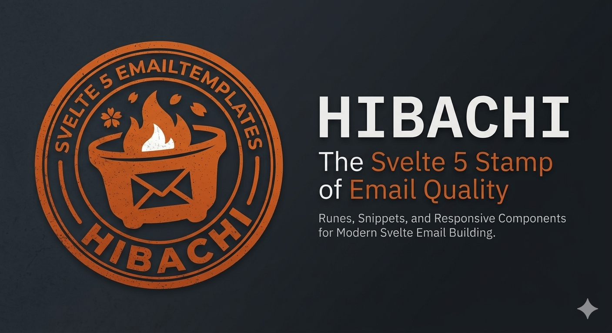

<p align="center">
  
</p>

<p align="center">
  <a href="https://www.npmjs.com/package/hibachi"></a>
  <a href="https://github.com/kdaisho/hibachi/blob/master/LICENSE"></a>
  <a href="https://www.npmjs.com/package/hibachi"></a>
</p>

A Svelte 5 rewrite of [svelte-email](https://github.com/carstenlebek/svelte-email), updated for runes, snippets, and modern patterns. Written in TypeScript with full type definitions.

## Installation

```bash
npm install hibachi
```

Or with your preferred package manager:

```bash
pnpm add hibachi
yarn add hibachi
```

## Getting started

### 1. Create an email template

`src/lib/emails/Hello.svelte`

```svelte
<script>
    import { Button, Hr, Html, Text } from 'hibachi';

    let { name = 'World' } = $props();
</script>

<Html lang="en">
    <Text>Hello, {name}!</Text>
    <Hr />
    <Button href="https://svelte.dev">Visit Svelte</Button>
</Html>
```

### 2. Render and send

This example uses [Nodemailer](https://nodemailer.com/), but any email service works.

`src/routes/emails/hello/+server.ts`

```ts
import { render } from 'hibachi';
import Hello from '$lib/emails/Hello.svelte';
import nodemailer from 'nodemailer';

const transporter = nodemailer.createTransport({
    host: 'smtp.ethereal.email',
    port: 587,
    secure: false,
    auth: {
        user: 'my_user',
        pass: 'my_password',
    },
});

const emailHtml = render({
    template: Hello,
    props: { name: 'Svelte' },
});

transporter.sendMail({
    from: 'you@example.com',
    to: 'user@gmail.com',
    subject: 'Hello world',
    html: emailHtml,
});
```

## Render API

`render()` is a **synchronous** function that returns a **string**.

```ts
render({
    template: Component,   // Svelte component (required)
    props?: {},            // Props to pass to the component
    options?: {
        pretty?: boolean,  // Pretty-print the HTML output (default: false)
        plainText?: boolean, // Convert HTML to plain text (default: false)
    },
}): string
```

### Examples

```ts
// HTML (default)
render({ template: Hello, props: { name: 'Svelte' } });

// Pretty-printed HTML
render({ template: Hello, options: { pretty: true } });

// Plain text
render({ template: Hello, options: { plainText: true } });
```

## Components

### Overview

| Component   | Description                          |
| ----------- | ------------------------------------ |
| `Html`      | Root document wrapper                |
| `Head`      | Document head for metadata           |
| `Body`      | Email body                           |
| `Container` | Centered content wrapper             |
| `Section`   | Table-based row grouping             |
| `Column`    | Table-based column layout            |
| `Heading`   | h1-h6 headings                       |
| `Text`      | Paragraph text                       |
| `Button`    | Call-to-action link styled as button |
| `Link`      | Anchor link                          |
| `Img`       | Image                                |
| `Hr`        | Horizontal rule                      |
| `Preview`   | Inbox preview text                   |

All components accept standard HTML attributes for their underlying element (e.g., `id`, `class`, `data-*`, `aria-*`). The `style` prop accepts a `Record<string, string | number | null>` object (camelCase keys).

### Props reference

#### Html

| Prop   | Type     | Default |
| ------ | -------- | ------- |
| `lang` | `string` | `'en'`  |

#### Head

No custom props. Automatically includes a `<meta charset="UTF-8" />` tag.

#### Body

| Prop    | Type                                     | Default |
| ------- | ---------------------------------------- | ------- |
| `style` | `Record<string, string \| number \| null>` | `{}`    |

#### Container

| Prop    | Type                                     | Default |
| ------- | ---------------------------------------- | ------- |
| `style` | `Record<string, string \| number \| null>` | `{}`    |

Default styles: `max-width: 37.5em`.

#### Section

| Prop    | Type                                     | Default |
| ------- | ---------------------------------------- | ------- |
| `style` | `Record<string, string \| number \| null>` | `{}`    |

Renders as a `<table>` with columns laid out using CSS grid.

#### Column

| Prop    | Type                                     | Default |
| ------- | ---------------------------------------- | ------- |
| `style` | `Record<string, string \| number \| null>` | `{}`    |

Default styles: `display: inline-flex; justify-content: center; align-items: center`.

#### Heading

| Prop  | Type                                           | Default |
| ----- | ---------------------------------------------- | ------- |
| `as`  | `'h1' \| 'h2' \| 'h3' \| 'h4' \| 'h5' \| 'h6'` | `'h1'`  |
| `m`   | `string`                                       | -       |
| `mx`  | `string`                                       | -       |
| `my`  | `string`                                       | -       |
| `mt`  | `string`                                       | -       |
| `mr`  | `string`                                       | -       |
| `mb`  | `string`                                       | -       |
| `ml`  | `string`                                       | -       |

Margin values are automatically converted to pixels (e.g., `mt="10"` becomes `margin-top: 10px`).

#### Text

| Prop    | Type                                     | Default |
| ------- | ---------------------------------------- | ------- |
| `style` | `Record<string, string \| number \| null>` | `{}`    |

Default styles: `font-size: 14px; line-height: 24px; margin: 16px 0`.

#### Button

| Prop     | Type     | Default     |
| -------- | -------- | ----------- |
| `href`   | `string` | `''`        |
| `target` | `string` | `'_blank'`  |
| `pX`     | `number` | `0`         |
| `pY`     | `number` | `0`         |

`pX` and `pY` control horizontal and vertical padding in pixels.

#### Link

| Prop     | Type     | Default     |
| -------- | -------- | ----------- |
| `href`   | `string` | `''`        |
| `target` | `string` | `'_blank'`  |

Default styles: `color: #067df7; text-decoration: none`.

#### Img

| Prop     | Type     | Default |
| -------- | -------- | ------- |
| `alt`    | `string` | `''`    |
| `src`    | `string` | `''`    |
| `width`  | `string` | `'0'`   |
| `height` | `string` | `'0'`   |

Default styles: `display: block; outline: none; border: none; text-decoration: none`.

#### Hr

| Prop    | Type                                     | Default |
| ------- | ---------------------------------------- | ------- |
| `style` | `Record<string, string \| number \| null>` | `{}`    |

Default styles: `width: 100%; border: none; border-top: 1px solid #eaeaea`.

#### Preview

| Prop      | Type     | Default |
| --------- | -------- | ------- |
| `preview` | `string` | `''`    |

Renders hidden preview text visible in email client inbox views. Automatically pads to 150 characters.

## Differences from svelte-email

Hibachi is a ground-up rewrite, not a patch. Key changes:

- **Svelte 5 native** - uses runes (`$props()`) and snippets instead of Svelte 4 patterns
- **TypeScript-first** - full type definitions for all components and the render API
- **Simplified style prop** - accepts a `Record<string, string | number | null>` object instead of a CSS string
- **Modern tooling** - built with `@sveltejs/package`, Vite 6, and vitest

If you're migrating from svelte-email, the component names and general API shape are the same. The main changes are switching to `$props()` for component inputs and using object-style `style` props.

## Integrations

Hibachi renders to standard HTML, so it works with any email provider:

- [Nodemailer](https://nodemailer.com/)
- [SendGrid](https://sendgrid.com/)
- [Postmark](https://postmarkapp.com/)
- [AWS SES](https://aws.amazon.com/ses/)

## Contributing

Contributions are welcome. Please [open an issue](https://github.com/kdaisho/hibachi/issues) for bug reports or feature requests, or submit a pull request.

## Links

- [GitHub](https://github.com/kdaisho/hibachi)
- [npm](https://www.npmjs.com/package/hibachi)
- [Issues](https://github.com/kdaisho/hibachi/issues)

## License

[MIT](https://github.com/kdaisho/hibachi/blob/master/LICENSE)
